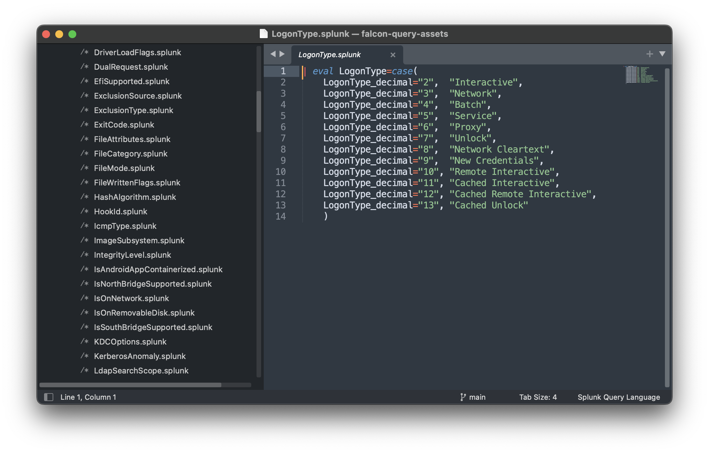

## Usage

These transforms can be viewed here or git cloned locally. If ususing local files, several IDEs (VSCode, SublimeText, etc.) have syntax highlighting pacakges available for files with the `.splunk` extension. We're working on highlighting for `.humio` files in varios IDEs.

Example

